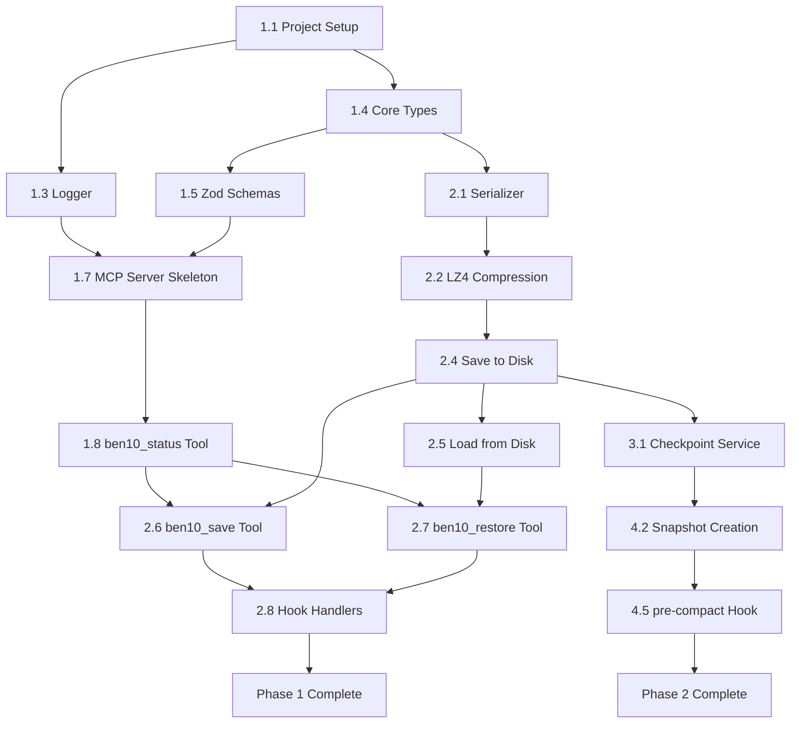

# Ben10 Implementation Plan

**Version:** 2.0
**Date:** January 2026
**Status:** Ready for Implementation
**Architecture:** MCP-First Hybrid (MCP Server + Lifecycle Hooks)

---

## Table of Contents

1. [Architecture Overview](#1-architecture-overview)
2. [Project Structure](#2-project-structure)
3. [Module Breakdown](#3-module-breakdown)
4. [Type Definitions](#4-type-definitions)
5. [Implementation Phases](#5-implementation-phases)
6. [Critical Path Analysis](#6-critical-path-analysis)
7. [Testing Strategy](#7-testing-strategy)
8. [CI/CD Pipeline](#8-cicd-pipeline)
9. [Risk Register](#9-risk-register)
10. [Open Technical Decisions](#10-open-technical-decisions)
11. [Success Metrics](#11-success-metrics)

---

## 1. Architecture Overview

Ben10 uses an **MCP-first hybrid architecture** combining:

1. **MCP Server** — Long-running service exposing tools and resources
2. **Lifecycle Hooks** — Claude Code hooks for automatic persistence events
3. **CLI** — Lightweight commands that communicate with the MCP server

```
┌─────────────────────────────────────────────────────────────────────┐
│                         Claude Code                                  │
├─────────────────────────────────────────────────────────────────────┤
│                                                                     │
│  Lifecycle Hooks                    MCP Protocol (stdio)            │
│  ┌─────────────────────┐           ┌──────────────────────────────┐│
│  │ SessionStart        │           │ Tools:                       ││
│  │  → ben10 hook start │──────────▶│  • ben10_save                ││
│  │                     │           │  • ben10_restore             ││
│  │ PreCompact          │           │  • ben10_status              ││
│  │  → ben10 hook compact──────────▶│  • ben10_snapshot_list       ││
│  │                     │           │  • ben10_snapshot_restore    ││
│  │ SessionEnd          │           │  • ben10_diff                ││
│  │  → ben10 hook end   │──────────▶│  • ben10_clear               ││
│  └─────────────────────┘           │                              ││
│                                    │ Resources:                   ││
│                                    │  • ben10://status            ││
│                                    │  • ben10://context           ││
│                                    │  • ben10://snapshots         ││
│                                    └──────────────────────────────┘│
└─────────────────────────────────────────────────────────────────────┘
                                    │
                    JSON-RPC 2.0 over stdio
                                    │
                                    ▼
┌─────────────────────────────────────────────────────────────────────┐
│                      Ben10 MCP Server                                │
│  ┌─────────────┐  ┌─────────────┐  ┌─────────────┐                 │
│  │  Context    │  │  Snapshot   │  │    File     │                 │
│  │  Manager    │  │  Service    │  │   Watcher   │                 │
│  └──────┬──────┘  └──────┬──────┘  └──────┬──────┘                 │
│         │                │                │                         │
│         ▼                ▼                ▼                         │
│  ┌─────────────────────────────────────────────────────────────┐   │
│  │                    Persistence Layer                         │   │
│  │  Serializer (MessagePack) → Compressor (LZ4/ZSTD) → FS      │   │
│  └─────────────────────────────────────────────────────────────┘   │
└─────────────────────────────────────────────────────────────────────┘
                                    │
                                    ▼
┌─────────────────────────────────────────────────────────────────────┐
│  .ben10/                                                             │
│    ├── current.ctx              # Active context                    │
│    ├── current.ctx.meta         # Metadata (JSON)                   │
│    ├── checkpoints/             # Crash recovery                    │
│    ├── compaction-snapshots/    # Pre-compaction archives           │
│    └── config.yaml              # Project-specific Ben10 settings   │
└─────────────────────────────────────────────────────────────────────┘
```

### Key Design Decisions

| Decision | Choice | Rationale |
|----------|--------|-----------|
| Primary interface | MCP Server | Persistent state, Claude can invoke tools directly |
| Lifecycle events | Claude Code Hooks | Automatic save/restore without user intervention |
| Hook → Server communication | CLI shim | Hooks call `ben10 hook <event>` which signals server |
| Transport | stdio | Standard MCP transport, no port management |
| State location | Per-project `.ben10/` | Directory-scoped, Ben10's own namespace |

### Configuration Files

**`.mcp.json`** (project root, checked into git):
```json
{
  "mcpServers": {
    "ben10": {
      "command": "ben10",
      "args": ["serve"],
      "env": {
        "BEN10_LOG_LEVEL": "info"
      }
    }
  }
}
```

**`.claude/settings.json`** (project-specific hooks):
```json
{
  "hooks": {
    "SessionStart": [{
      "hooks": [{
        "type": "command",
        "command": "ben10 hook session-start"
      }]
    }],
    "PreCompact": [{
      "hooks": [{
        "type": "command",
        "command": "ben10 hook pre-compact"
      }]
    }],
    "SessionEnd": [{
      "hooks": [{
        "type": "command",
        "command": "ben10 hook session-end"
      }]
    }]
  }
}
```

---

## 2. Project Structure

```
ben10/
├── src/
│   ├── core/                        # Domain logic (pure, no I/O)
│   │   ├── context/
│   │   │   ├── state.ts             # ContextState type & operations
│   │   │   ├── serializer.ts        # MessagePack encode/decode
│   │   │   ├── compressor.ts        # LZ4/ZSTD compression
│   │   │   ├── validator.ts         # Schema validation (Zod)
│   │   │   └── migrator.ts          # Version migrations
│   │   ├── snapshot/
│   │   │   ├── snapshot.ts          # CompactionSnapshot operations
│   │   │   ├── index-manager.ts     # Snapshot index CRUD
│   │   │   └── pruner.ts            # Retention policy logic
│   │   ├── reconciliation/
│   │   │   ├── differ.ts            # Context vs filesystem diff
│   │   │   └── merger.ts            # Merge strategies
│   │   ├── crypto/
│   │   │   ├── hash.ts              # SHA-256, content hashing
│   │   │   ├── checksum.ts          # Integrity verification
│   │   │   └── redactor.ts          # Secret detection & redaction
│   │   └── types.ts                 # Shared domain types
│   │
│   ├── mcp/                         # MCP Server implementation
│   │   ├── server.ts                # McpServer setup & lifecycle
│   │   ├── tools/                   # MCP Tool handlers
│   │   │   ├── save.ts              # ben10_save tool
│   │   │   ├── restore.ts           # ben10_restore tool
│   │   │   ├── status.ts            # ben10_status tool
│   │   │   ├── diff.ts              # ben10_diff tool
│   │   │   ├── clear.ts             # ben10_clear tool
│   │   │   ├── snapshot-list.ts     # ben10_snapshot_list tool
│   │   │   ├── snapshot-restore.ts  # ben10_snapshot_restore tool
│   │   │   └── index.ts             # Tool registration
│   │   ├── resources/               # MCP Resource handlers
│   │   │   ├── status.ts            # ben10://status resource
│   │   │   ├── context.ts           # ben10://context resource
│   │   │   ├── snapshots.ts         # ben10://snapshots/* resources
│   │   │   └── index.ts             # Resource registration
│   │   └── hooks/                   # Hook event handlers
│   │       ├── session-start.ts     # SessionStart hook handler
│   │       ├── session-end.ts       # SessionEnd hook handler
│   │       ├── pre-compact.ts       # PreCompact hook handler
│   │       └── index.ts             # Hook dispatcher
│   │
│   ├── adapters/                    # External integrations (ports)
│   │   ├── fs/
│   │   │   ├── interface.ts         # FileSystem port definition
│   │   │   ├── node-fs.ts           # Node.js fs implementation
│   │   │   └── memory-fs.ts         # In-memory for testing
│   │   ├── config/
│   │   │   ├── interface.ts         # ConfigLoader port
│   │   │   ├── loader.ts            # YAML/JSON config loader
│   │   │   └── schema.ts            # Config validation schema
│   │   └── ipc/
│   │       ├── interface.ts         # IPC port for hook→server
│   │       └── socket.ts            # Unix socket / named pipe
│   │
│   ├── cli/                         # Command-line interface
│   │   ├── commands/
│   │   │   ├── serve.ts             # ben10 serve (start MCP server)
│   │   │   ├── hook.ts              # ben10 hook <event> (hook shim)
│   │   │   ├── status.ts            # ben10 status (standalone)
│   │   │   ├── init.ts              # ben10 init (setup project)
│   │   │   └── index.ts             # Command registration
│   │   ├── ui/
│   │   │   ├── output.ts            # Formatted output helpers
│   │   │   └── table.ts             # Table rendering
│   │   ├── parser.ts                # Argument parsing (commander)
│   │   └── index.ts                 # CLI entry point
│   │
│   ├── services/                    # Application services
│   │   ├── context-manager.ts       # Main orchestrator
│   │   ├── checkpoint-service.ts    # Periodic checkpointing
│   │   └── snapshot-service.ts      # Compaction snapshot handling
│   │
│   ├── infrastructure/              # Cross-cutting concerns
│   │   ├── logger.ts                # Structured logging (stderr only!)
│   │   ├── errors.ts                # Error types
│   │   └── result.ts                # Result<T,E> utilities
│   │
│   └── index.ts                     # Library entry point
│
├── tests/
│   ├── unit/
│   │   ├── core/                    # Pure function tests
│   │   ├── mcp/                     # MCP handler tests
│   │   └── services/                # Mocked service tests
│   ├── integration/
│   │   ├── mcp/                     # MCP protocol tests
│   │   ├── persistence/             # Real serialization tests
│   │   └── hooks/                   # Hook integration tests
│   ├── e2e/
│   │   └── scenarios/               # Full workflow tests
│   └── fixtures/
│       ├── contexts/                # Sample .ctx files
│       └── hook-inputs/             # Sample hook JSON inputs
│
├── .github/workflows/
│   ├── ci.yml
│   ├── release.yml
│   └── security.yml
│
├── package.json
├── tsconfig.json
├── biome.json
├── vitest.config.ts
├── tsup.config.ts
├── CLAUDE.md
└── README.md
```

---

## 3. Module Breakdown

### 3.1 MCP Server Module (NEW - Critical Path)

**Purpose:** Implement MCP protocol server exposing Ben10 functionality to Claude Code.

**Public Interface:**
```typescript
// server.ts
import { McpServer } from "@modelcontextprotocol/sdk/server/mcp.js";
import { StdioServerTransport } from "@modelcontextprotocol/sdk/server/stdio.js";

export interface Ben10ServerDeps {
  contextManager: ContextManager;
  snapshotService: SnapshotService;
  config: Ben10Config;
  logger: Logger;
}

export function createBen10Server(deps: Ben10ServerDeps): McpServer;
export async function startServer(server: McpServer): Promise<void>;
```

**MCP Tools Exposed:**

| Tool | Description | Input Schema |
|------|-------------|--------------|
| `ben10_save` | Save current context | `{ name?: string }` |
| `ben10_restore` | Restore context | `{ name?: string, mode?: RestoreMode }` |
| `ben10_status` | Get context status | `{}` |
| `ben10_diff` | Show filesystem changes | `{}` |
| `ben10_clear` | Clear context | `{ force?: boolean }` |
| `ben10_snapshot_list` | List compaction snapshots | `{ verbose?: boolean }` |
| `ben10_snapshot_restore` | Restore from snapshot | `{ id: string }` |
| `ben10_checkpoint` | Create manual checkpoint | `{}` |

**MCP Resources Exposed:**

| URI | Description | MIME Type |
|-----|-------------|-----------|
| `ben10://status` | Current context status | `application/json` |
| `ben10://context` | Context summary (redacted) | `application/json` |
| `ben10://snapshots` | Snapshot index | `application/json` |
| `ben10://snapshots/{id}` | Individual snapshot metadata | `application/json` |

**Dependencies:**
- External: `@modelcontextprotocol/sdk`, `zod`
- Internal: `services/*`, `core/*`, `infrastructure/*`

**Test Strategy:**
- Unit tests for each tool handler with mocked services
- Integration tests using MCP Inspector
- E2E tests with actual Claude Code connection

---

### 3.2 MCP Hook Handlers

**Purpose:** Process lifecycle events from Claude Code hooks.

**Hook Input Schema (received via stdin from Claude Code):**
```typescript
interface HookInput {
  session_id: string;
  transcript_path: string;
  cwd: string;
  hook_event_name: string;
  model: string;
}
```

**Handler Interface:**
```typescript
// hooks/index.ts
export interface HookHandler {
  (input: HookInput, deps: HookDeps): Promise<HookResult>;
}

export interface HookResult {
  success: boolean;
  message?: string;
  error?: string;
}

export const handlers: Record<string, HookHandler> = {
  'session-start': handleSessionStart,  // Handles startup, compact, resume via source field
  'session-end': handleSessionEnd,
};
```

**Hook Behaviors:**

| Event | Source | Action |
|-------|--------|--------|
| `SessionStart` | `startup` | Load `.ben10/context.json` if exists, make available via MCP resource |
| `SessionStart` | `compact` | Read freshly-compacted transcript, save to `.ben10/context.json` |
| `SessionStart` | `resume` | No action (session continuing) |
| `SessionEnd` | - | Read current transcript, save to `.ben10/context.json` |

**Key Insight:** The SessionStart hook with `source: "compact"` fires immediately AFTER compaction completes, giving us access to the compacted transcript. This is effectively a PostCompact hook.

---

### 3.3 Core: Context Module

**Purpose:** Define and manipulate ContextState without I/O operations.

**Public Interface:**
```typescript
// state.ts
export interface ContextState { /* see types section */ }
export function createEmptyContext(dir: string): ContextState;
export function updateContext(state: ContextState, patch: Partial<ContextState>): ContextState;
export function getContextMetrics(state: ContextState): ContextMetrics;

// serializer.ts
export function serialize(state: ContextState): Buffer;
export function deserialize(buffer: Buffer): Result<ContextState, DeserializeError>;

// compressor.ts
export function compressLz4(data: Buffer): Buffer;
export function decompressLz4(data: Buffer): Buffer;
export function compressZstd(data: Buffer, level?: number): Buffer;
export function decompressZstd(data: Buffer): Buffer;

// validator.ts
export const ContextStateSchema: z.ZodType<ContextState>;
export function validateContext(data: unknown): Result<ContextState, ValidationError>;

// migrator.ts
export function migrateContext(state: ContextState, targetVersion: string): Result<ContextState, MigrationError>;
```

**Dependencies:**
- External: `@msgpack/msgpack`, `lz4js`, `fzstd`, `zod`
- Internal: `core/types`, `infrastructure/result`

---

### 3.4 Core: Snapshot Module

**Purpose:** Manage compaction snapshots.

```typescript
// snapshot.ts
export function createSnapshot(state: ContextState, trigger: CompactionTrigger): CompactionSnapshot;
export function snapshotToBuffer(snapshot: CompactionSnapshot, state: ContextState): Buffer;
export function bufferToSnapshot(buffer: Buffer): Result<{snapshot: CompactionSnapshot, state: ContextState}, ParseError>;

// index-manager.ts
export function createIndex(): SnapshotIndex;
export function addToIndex(index: SnapshotIndex, snapshot: CompactionSnapshot): SnapshotIndex;
export function removeFromIndex(index: SnapshotIndex, id: string): SnapshotIndex;
export function findSnapshot(index: SnapshotIndex, id: string): CompactionSnapshotSummary | undefined;

// pruner.ts
export function getSnapshotsToPrune(index: SnapshotIndex, policy: RetentionPolicy, now?: number): string[];
```

---

### 3.5 Services: Context Manager

**Purpose:** Main orchestration layer.

```typescript
export interface ContextManager {
  // Lifecycle
  initialize(workingDir: string): Promise<Result<ContextState | null, InitError>>;
  persist(): Promise<Result<void, PersistError>>;
  checkpoint(): Promise<Result<void, CheckpointError>>;
  shutdown(): Promise<void>;

  // State
  getState(): ContextState | null;
  getStatus(): ContextStatus;
  updateState(patch: Partial<ContextState>): void;

  // Operations
  save(options?: SaveOptions): Promise<Result<string, SaveError>>;
  restore(options?: RestoreOptions): Promise<Result<ContextState, RestoreError>>;
  clear(force?: boolean): Promise<Result<void, ClearError>>;
  getDiff(): Promise<Result<ContextDiff, DiffError>>;

  // Snapshots
  createCompactionSnapshot(trigger: CompactionTrigger): Promise<Result<string, SnapshotError>>;
  listSnapshots(): Promise<Result<SnapshotIndex, SnapshotError>>;
  restoreSnapshot(id: string): Promise<Result<ContextState, SnapshotError>>;
}
```

---

### 3.6 CLI Module

**Commands:**

```
ben10 <command> [options]

Commands:
  serve                  Start MCP server (called by Claude Code)
  hook <event>           Handle lifecycle hook event
  init                   Initialize Ben10 in current project
  status                 Show context status (standalone)
  version                Show version

Hook Events:
  session-start          Called on SessionStart hook
  session-end            Called on SessionEnd hook
  pre-compact            Called on PreCompact hook
```

**Key Implementation Notes:**

1. **`ben10 serve`** — Starts MCP server on stdio. NEVER use console.log (corrupts JSON-RPC).
2. **`ben10 hook <event>`** — Reads hook input from stdin, signals running server or operates standalone.
3. **`ben10 init`** — Creates `.mcp.json` and `.claude/settings.json` with proper configuration.

---

## 4. Type Definitions

### 4.1 Core Domain Types

```typescript
// ==================== Context State ====================

export interface ContextState {
  version: string;
  directoryPath: string;
  directoryHash: string;
  createdAt: number;
  updatedAt: number;
  sessionCount: number;
  conversation: ConversationHistory;
  files: FileRegistry;
  tools: ToolExecutionHistory;
  tasks: TaskState;
  preferences: LearnedPreferences;
}

export interface ConversationHistory {
  messages: Message[];
  totalTokens: number;
  summary: string | null;
}

export interface Message {
  id: string;
  role: 'user' | 'assistant' | 'system';
  content: string;
  timestamp: number;
  tokenCount: number;
  metadata: MessageMetadata;
}

export interface MessageMetadata {
  toolCalls?: ToolCall[];
  fileReferences?: string[];
  taskReferences?: string[];
}

// ==================== File Registry ====================

export interface FileRegistry {
  trackedFiles: Record<string, FileMetadata>;
  accessPatterns: AccessPattern[];
  changeLog: ChangeLogEntry[];
}

export interface FileMetadata {
  path: string;
  hash: string;
  lastAccessed: number;
  accessCount: number;
  contentSummary: string | null;
  relevanceScore: number;
}

// ==================== Status Types ====================

export interface ContextStatus {
  exists: boolean;
  directory: string;
  lastSaved: number | null;
  sessionCount: number;
  messageCount: number;
  tokenCount: number;
  trackedFiles: number;
  checkpoints: CheckpointInfo[];
  storageSize: number;
  health: 'good' | 'warning' | 'error';
  warnings: string[];
}

export interface CheckpointInfo {
  id: string;
  timestamp: number;
  messageCount: number;
}
```

### 4.2 MCP Types

```typescript
// ==================== MCP Tool Schemas (Zod) ====================

import { z } from 'zod';

export const SaveInputSchema = z.object({
  name: z.string().optional().describe('Named snapshot identifier'),
});

export const RestoreInputSchema = z.object({
  name: z.string().optional().describe('Named snapshot to restore'),
  mode: z.enum(['full', 'summary', 'selective']).optional().describe('Restore mode'),
});

export const SnapshotRestoreInputSchema = z.object({
  id: z.string().describe('Snapshot ID to restore'),
});

export const ClearInputSchema = z.object({
  force: z.boolean().optional().describe('Skip confirmation'),
});

// ==================== MCP Tool Results ====================

export interface McpToolResult {
  content: Array<{
    type: 'text';
    text: string;
  }>;
  isError?: boolean;
}

export function mcpSuccess(message: string): McpToolResult {
  return { content: [{ type: 'text', text: message }] };
}

export function mcpError(message: string): McpToolResult {
  return { content: [{ type: 'text', text: message }], isError: true };
}

export function mcpJson(data: unknown): McpToolResult {
  return { content: [{ type: 'text', text: JSON.stringify(data, null, 2) }] };
}
```

### 4.3 Compaction Snapshot Types

```typescript
export interface CompactionSnapshot {
  id: string;
  createdAt: number;
  sessionId: string;
  preCompaction: CompactionMetrics;
  postCompaction: CompactionMetrics;
  trigger: CompactionTrigger;
  compactionRatio: number;
  contentHash: string;
  compressedSize: number;
  uncompressedSize: number;
  pinned: boolean;
  tags: string[];
  notes: string;
}

export interface CompactionMetrics {
  tokenCount: number;
  messageCount: number;
  fileCount?: number;
  toolExecutionCount?: number;
}

export type CompactionTrigger = 'threshold' | 'manual' | 'memory_pressure';

export interface SnapshotIndex {
  version: string;
  snapshots: CompactionSnapshotSummary[];
  totalSizeBytes: number;
  lastPruned: number;
}

export interface CompactionSnapshotSummary {
  id: string;
  createdAt: number;
  tokenCount: number;
  compressedSize: number;
  pinned: boolean;
}
```

### 4.4 Configuration Types

```typescript
export interface Ben10Config {
  context: ContextConfig;
  mcp: McpConfig;
}

export interface ContextConfig {
  autoSave: boolean;
  autoRestore: boolean;
  checkpointInterval: number;
  storageLocation: string;
  maxStorageMb: number;
  historyRetentionCount: number;
  checkpointRetentionDays: number;
  compactionSnapshots: CompactionSnapshotConfig;
  excludePatterns: string[];
  sensitiveRedaction: boolean;
}

export interface McpConfig {
  logLevel: 'debug' | 'info' | 'warn' | 'error';
}

export interface CompactionSnapshotConfig {
  enabled: boolean;
  retentionCount: number;
  retentionDays: number;
  maxStorageMb: number;
  compressionLevel: number;
}

export const DEFAULT_CONFIG: Ben10Config = {
  context: {
    autoSave: true,
    autoRestore: true,
    checkpointInterval: 10,
    storageLocation: '.ben10',
    maxStorageMb: 100,
    historyRetentionCount: 5,
    checkpointRetentionDays: 7,
    compactionSnapshots: {
      enabled: true,
      retentionCount: 5,
      retentionDays: 30,
      maxStorageMb: 500,
      compressionLevel: 19,
    },
    excludePatterns: ['*.log', 'node_modules/**', '.env*'],
    sensitiveRedaction: true,
  },
  mcp: {
    logLevel: 'info',
  },
};
```

### 4.5 Result Types and Errors

```typescript
export type Result<T, E = Error> =
  | { ok: true; value: T }
  | { ok: false; error: E };

export const ok = <T>(value: T): Result<T, never> => ({ ok: true, value });
export const err = <E>(error: E): Result<never, E> => ({ ok: false, error });

export enum ErrorCode {
  // File system
  FS_NOT_FOUND = 'FS_NOT_FOUND',
  FS_PERMISSION_DENIED = 'FS_PERMISSION_DENIED',
  FS_WRITE_ERROR = 'FS_WRITE_ERROR',

  // Context
  CONTEXT_NOT_FOUND = 'CONTEXT_NOT_FOUND',
  CONTEXT_CORRUPTED = 'CONTEXT_CORRUPTED',
  CONTEXT_LOCKED = 'CONTEXT_LOCKED',

  // Serialization
  SERIALIZE_FAILED = 'SERIALIZE_FAILED',
  DESERIALIZE_FAILED = 'DESERIALIZE_FAILED',
  CHECKSUM_MISMATCH = 'CHECKSUM_MISMATCH',

  // Snapshots
  SNAPSHOT_NOT_FOUND = 'SNAPSHOT_NOT_FOUND',
  SNAPSHOT_CORRUPTED = 'SNAPSHOT_CORRUPTED',

  // MCP
  MCP_TOOL_ERROR = 'MCP_TOOL_ERROR',
  MCP_RESOURCE_ERROR = 'MCP_RESOURCE_ERROR',

  // Hook
  HOOK_INVALID_INPUT = 'HOOK_INVALID_INPUT',
  HOOK_EXECUTION_FAILED = 'HOOK_EXECUTION_FAILED',
}

export interface Ben10Error {
  code: ErrorCode;
  message: string;
  details?: Record<string, unknown>;
}
```

---

## 5. Implementation Phases

### Phase 1: MCP Foundation (Sprint 1-2)

**Goal:** Working MCP server with basic save/restore, hook integration

**Sprint 1: MCP Server Core (Week 1-2)**

| ID | Task | Points | Deps | Notes |
|----|------|--------|------|-------|
| 1.1 | Project scaffolding (pnpm, tsconfig, biome, vitest) | 2 | - | Include @modelcontextprotocol/sdk |
| 1.2 | Result type and error infrastructure | 2 | 1.1 | |
| 1.3 | Logger implementation (stderr only!) | 2 | 1.1 | Critical: never stdout |
| 1.4 | Core types definition | 3 | 1.1 | ContextState, etc. |
| 1.5 | Zod schemas for all types | 3 | 1.4 | Validation + MCP input schemas |
| 1.6 | FileSystem adapter (node + memory) | 3 | 1.2 | |
| 1.7 | MCP server skeleton | 5 | 1.3, 1.5 | McpServer + StdioTransport |
| 1.8 | MCP tool: ben10_status | 3 | 1.7 | First tool, validates setup |

**Sprint 2: Persistence + Hooks (Week 3-4)**

| ID | Task | Points | Deps | Notes |
|----|------|--------|------|-------|
| 2.1 | MessagePack serializer | 5 | 1.4 | |
| 2.2 | LZ4 compression | 3 | 2.1 | Hot path compression |
| 2.3 | Checksum implementation | 2 | 2.1 | |
| 2.4 | Context save to disk | 5 | 1.6, 2.2, 2.3 | |
| 2.5 | Context load from disk | 5 | 2.4 | |
| 2.6 | MCP tool: ben10_save | 3 | 2.4, 1.7 | |
| 2.7 | MCP tool: ben10_restore | 3 | 2.5, 1.7 | |
| 2.8 | Hook handler: session-start (startup/compact/resume) | 5 | 2.5 | Reads transcript on compact |
| 2.8b | Hook handler: session-end | 3 | 2.4 | Saves transcript context |
| 2.9 | CLI: ben10 serve | 3 | 1.7 | |
| 2.10 | CLI: ben10 hook | 3 | 2.8 | |
| 2.11 | CLI: ben10 init | 3 | 1.6 | Generate .mcp.json + hooks |

**Definition of Done - Phase 1:**
- [ ] `ben10 serve` starts MCP server on stdio
- [ ] `ben10_status` tool returns context status
- [ ] `ben10_save` / `ben10_restore` tools work
- [ ] `ben10 hook session-start` restores context
- [ ] `ben10 hook session-end` saves context
- [ ] `ben10 init` creates proper configuration files
- [ ] 90% test coverage on core + MCP modules
- [ ] CI pipeline running

---

### Phase 2: Robustness (Sprint 3-4)

**Goal:** Checkpointing, crash recovery, compaction snapshots, more tools

**Sprint 3: Checkpointing & Resources (Week 5-6)**

| ID | Task | Points | Deps | Notes |
|----|------|--------|------|-------|
| 3.1 | Checkpoint service | 5 | 2.4 | |
| 3.2 | Rolling checkpoint management | 3 | 3.1 | |
| 3.3 | Crash recovery detection | 3 | 3.2 | |
| 3.4 | MCP resource: ben10://status | 3 | 1.7 | |
| 3.5 | MCP resource: ben10://context | 3 | 1.7 | Redacted summary |
| 3.6 | MCP tool: ben10_diff | 5 | 1.7 | |
| 3.7 | MCP tool: ben10_clear | 3 | 1.7 | |
| 3.8 | MCP tool: ben10_checkpoint | 3 | 3.1 | Manual checkpoint |

**Sprint 4: Compaction Snapshots (Week 7-8)**

| ID | Task | Points | Deps | Notes |
|----|------|--------|------|-------|
| 4.1 | ZSTD compression | 3 | 2.1 | For snapshots |
| 4.2 | Snapshot creation | 5 | 4.1 | |
| 4.3 | Snapshot index management | 5 | 4.2 | |
| 4.4 | Retention policy pruning | 3 | 4.3 | |
| 4.5 | Hook handler: pre-compact | 5 | 4.2 | |
| 4.6 | MCP tool: ben10_snapshot_list | 3 | 4.3 | |
| 4.7 | MCP tool: ben10_snapshot_restore | 5 | 4.2 | |
| 4.8 | MCP resource: ben10://snapshots | 3 | 4.3 | |
| 4.9 | Config loader with hierarchy | 5 | 1.6 | |

**Definition of Done - Phase 2:**
- [ ] Checkpoints created every N messages
- [ ] Crash recovery offers checkpoint restore
- [ ] PreCompact hook creates snapshot
- [ ] All snapshot tools working
- [ ] MCP resources exposed and readable
- [ ] Config file hierarchy respected

---

### Phase 3: Polish & Security (Sprint 5-6)

**Goal:** Secret redaction, reconciliation, edge cases, documentation

**Sprint 5: Security & Reconciliation (Week 9-10)**

| ID | Task | Points | Deps | Notes |
|----|------|--------|------|-------|
| 5.1 | Secret detection patterns | 5 | - | |
| 5.2 | Automatic redaction | 5 | 5.1 | |
| 5.3 | File hash computation | 3 | 1.6 | |
| 5.4 | Diff computation | 5 | 5.3 | |
| 5.5 | Merge strategies | 5 | 5.4 | |
| 5.6 | File permissions (0600) | 2 | 2.4 | |
| 5.7 | Storage limit enforcement | 3 | 2.4, 4.9 | |

**Sprint 6: Edge Cases & Docs (Week 11-12)**

| ID | Task | Points | Deps | Notes |
|----|------|--------|------|-------|
| 6.1 | Lazy loading for large contexts | 5 | 2.5 | |
| 6.2 | Concurrent access handling | 5 | 2.4 | Lock file |
| 6.3 | Schema migrations | 5 | 2.5 | |
| 6.4 | Edge case hardening | 5 | * | All PRD edge cases |
| 6.5 | Performance benchmarks | 5 | * | |
| 6.6 | README documentation | 3 | * | |
| 6.7 | Release automation | 3 | 1.1 | |

**Definition of Done - Phase 3:**
- [ ] Secrets automatically redacted
- [ ] Diff shows filesystem changes
- [ ] Storage limits enforced
- [ ] All PRD edge cases handled
- [ ] Performance targets met
- [ ] npm package publishable

---

## 6. Critical Path Analysis



**Critical Path:**
1.1 → 1.4 → 1.5 → 1.7 → 1.8 → 2.6 → 2.8 → Phase 1

**Blocking Dependencies:**
1. MCP SDK must be integrated before any tools (1.7)
2. Serialization must work before save/restore (2.1-2.3)
3. Hook handlers depend on save/restore (2.8)

**Parallel Workstreams:**
- Serialization (2.1-2.3) can proceed in parallel with MCP skeleton (1.7)
- Snapshot module (4.1-4.4) independent of checkpointing (3.1-3.3)
- Security (5.1-5.2) independent of main path

---

## 7. Testing Strategy

### 7.1 MCP Server Tests

```typescript
// tests/unit/mcp/tools/status.test.ts
import { describe, it, expect, vi } from 'vitest';
import { handleStatus } from '../../../../src/mcp/tools/status';
import { createMockContextManager } from '../../../mocks';

describe('ben10_status tool', () => {
  it('returns context status when context exists', async () => {
    const manager = createMockContextManager({
      state: createTestContext(),
    });

    const result = await handleStatus({}, { contextManager: manager });

    expect(result.isError).toBeUndefined();
    const data = JSON.parse(result.content[0].text);
    expect(data.exists).toBe(true);
    expect(data.messageCount).toBe(10);
  });

  it('returns exists: false when no context', async () => {
    const manager = createMockContextManager({ state: null });

    const result = await handleStatus({}, { contextManager: manager });

    const data = JSON.parse(result.content[0].text);
    expect(data.exists).toBe(false);
  });
});
```

### 7.2 Hook Handler Tests

```typescript
// tests/unit/mcp/hooks/session-start.test.ts
import { describe, it, expect } from 'vitest';
import { handleSessionStart } from '../../../../src/mcp/hooks/session-start';

describe('session-start hook', () => {
  it('restores existing context', async () => {
    const deps = createMockHookDeps({
      contextExists: true,
    });
    const input: HookInput = {
      session_id: 'test-123',
      cwd: '/project',
      hook_event_name: 'SessionStart',
      transcript_path: '/tmp/transcript.jsonl',
      model: 'claude-sonnet-4',
    };

    const result = await handleSessionStart(input, deps);

    expect(result.success).toBe(true);
    expect(deps.contextManager.restore).toHaveBeenCalled();
  });

  it('creates new context when none exists', async () => {
    const deps = createMockHookDeps({
      contextExists: false,
    });
    const input = createTestHookInput();

    const result = await handleSessionStart(input, deps);

    expect(result.success).toBe(true);
    expect(deps.contextManager.initialize).toHaveBeenCalled();
  });
});
```

### 7.3 Integration Tests with MCP Inspector

```typescript
// tests/integration/mcp/server.integration.test.ts
import { describe, it, expect, beforeAll, afterAll } from 'vitest';
import { spawn } from 'child_process';
import { Client } from '@modelcontextprotocol/sdk/client/index.js';
import { StdioClientTransport } from '@modelcontextprotocol/sdk/client/stdio.js';

describe('MCP Server Integration', () => {
  let client: Client;
  let serverProcess: ChildProcess;

  beforeAll(async () => {
    serverProcess = spawn('node', ['dist/cli/index.js', 'serve'], {
      cwd: testProjectDir,
    });

    const transport = new StdioClientTransport({
      command: 'node',
      args: ['dist/cli/index.js', 'serve'],
    });

    client = new Client({ name: 'test-client', version: '1.0.0' });
    await client.connect(transport);
  });

  afterAll(async () => {
    await client.close();
    serverProcess.kill();
  });

  it('lists available tools', async () => {
    const tools = await client.listTools();

    expect(tools.tools.map(t => t.name)).toContain('ben10_status');
    expect(tools.tools.map(t => t.name)).toContain('ben10_save');
  });

  it('executes ben10_status tool', async () => {
    const result = await client.callTool({ name: 'ben10_status', arguments: {} });

    expect(result.content[0].type).toBe('text');
    const data = JSON.parse(result.content[0].text);
    expect(data).toHaveProperty('exists');
  });
});
```

### 7.4 E2E Scenarios

| Scenario | Description | Assertions |
|----------|-------------|------------|
| Full lifecycle | init → session-start → work → session-end → session-start | Context restored correctly |
| Compaction | Long session → pre-compact hook → verify snapshot | Snapshot created, indexed |
| Crash recovery | Save → kill process → restart → restore | Checkpoint offered |
| MCP tool access | Claude calls ben10_status | Returns valid JSON |
| Resource access | @ben10://status in conversation | Resource content returned |

---

## 8. CI/CD Pipeline

### 8.1 GitHub Actions: CI

```yaml
# .github/workflows/ci.yml
name: CI

on:
  push:
    branches: [main]
  pull_request:
    branches: [main]

jobs:
  lint:
    runs-on: ubuntu-latest
    steps:
      - uses: actions/checkout@v4
      - uses: pnpm/action-setup@v4
        with:
          version: 9
      - uses: actions/setup-node@v4
        with:
          node-version: '20'
          cache: 'pnpm'
      - run: pnpm install --frozen-lockfile
      - run: pnpm lint

  typecheck:
    runs-on: ubuntu-latest
    steps:
      - uses: actions/checkout@v4
      - uses: pnpm/action-setup@v4
        with:
          version: 9
      - uses: actions/setup-node@v4
        with:
          node-version: '20'
          cache: 'pnpm'
      - run: pnpm install --frozen-lockfile
      - run: pnpm typecheck

  test:
    runs-on: ubuntu-latest
    steps:
      - uses: actions/checkout@v4
      - uses: pnpm/action-setup@v4
        with:
          version: 9
      - uses: actions/setup-node@v4
        with:
          node-version: '20'
          cache: 'pnpm'
      - run: pnpm install --frozen-lockfile
      - run: pnpm test:cov
      - uses: codecov/codecov-action@v4
        with:
          files: ./coverage/lcov.info

  test-matrix:
    strategy:
      matrix:
        os: [ubuntu-latest, macos-latest, windows-latest]
        node: ['20', '22']
    runs-on: ${{ matrix.os }}
    steps:
      - uses: actions/checkout@v4
      - uses: pnpm/action-setup@v4
        with:
          version: 9
      - uses: actions/setup-node@v4
        with:
          node-version: ${{ matrix.node }}
          cache: 'pnpm'
      - run: pnpm install --frozen-lockfile
      - run: pnpm test

  build:
    runs-on: ubuntu-latest
    needs: [lint, typecheck, test]
    steps:
      - uses: actions/checkout@v4
      - uses: pnpm/action-setup@v4
        with:
          version: 9
      - uses: actions/setup-node@v4
        with:
          node-version: '20'
          cache: 'pnpm'
      - run: pnpm install --frozen-lockfile
      - run: pnpm build
      - uses: actions/upload-artifact@v4
        with:
          name: dist
          path: dist/
```

---

## 9. Risk Register

| # | Risk | Prob | Impact | Mitigation | Status |
|---|------|------|--------|------------|--------|
| R1 | ~~Claude Code hooks unavailable~~ | - | - | ~~Research early~~ | **RESOLVED**: Hooks exist (SessionStart, SessionEnd, PreCompact) |
| R2 | MCP stdio logging corrupts JSON-RPC | H | H | Strict stderr-only logging; lint rule | Active |
| R3 | Large context performance | M | M | Lazy loading; benchmarks | Active |
| R4 | Hook execution timeout (60s default) | M | M | Optimize hot path; async where possible | Active |
| R5 | Cross-platform path issues | M | M | Use path module; test matrix | Active |
| R6 | Concurrent MCP + hook access | M | H | File locking; state synchronization | Active |
| R7 | Secret detection false positives | M | L | Configurable patterns; allowlist | Active |
| R8 | MessagePack schema evolution | M | H | Version field; migrations | Active |
| R9 | npm supply chain attack | L | H | Lock file; audit in CI | Active |
| R10 | MCP SDK breaking changes | L | M | Pin version; monitor releases | Active |

---

## 10. Open Technical Decisions

### 10.1 Hook → Server Communication (DECIDED)

**Decision:** Hooks call CLI shim, server maintains state independently.

The MCP server is started by Claude Code and runs for the session duration. Hooks are separate processes that execute and exit. Communication approach:

1. **Option A: File-based signaling** — Hook writes to `.claude/context/.hook-event`, server watches
2. **Option B: CLI calls server endpoint** — `ben10 hook` connects to running server via IPC
3. **Option C: Independent operation** — Hooks operate on files directly, server reloads

**Selected: Option C (Independent operation)**
- Simplest implementation
- No IPC complexity
- Server reloads state when needed
- Hooks are idempotent file operations

### 10.2 Serialization Format (DECIDED)

**Decision:** MessagePack with Zod validation

- MessagePack for binary serialization (fast, compact)
- Zod schemas for runtime validation
- Version field in header for migrations

### 10.3 Compression Strategy (DECIDED)

**Decision:** Dual compression

- LZ4 for hot path (checkpoints, active saves) — speed priority
- ZSTD level 19 for archival (snapshots) — size priority

---

## 11. Success Metrics

### 11.1 Performance

| Metric | Target | Measurement |
|--------|--------|-------------|
| Hook execution (session-start) | <500ms | Benchmark |
| Hook execution (session-end) | <500ms | Benchmark |
| Hook execution (pre-compact) | <2s | Benchmark |
| MCP tool response | <100ms | Benchmark |
| Save 10MB context | <500ms | Benchmark |
| Restore 10MB context | <500ms | Benchmark |

### 11.2 Quality

| Metric | Target |
|--------|--------|
| Line coverage | >90% |
| Branch coverage | >85% |
| TypeScript strict | 100% |
| Lint violations | 0 |

### 11.3 Reliability

| Metric | Target |
|--------|--------|
| Hook success rate | >99.9% |
| Save success rate | >99.9% |
| Restore success rate | >99.9% |
| Data loss incidents | 0 |

---

## Appendix A: Installation & Setup

After `npm install -g ben10`:

```bash
# In your project directory
ben10 init

# This creates:
# - .mcp.json (MCP server configuration)
# - .claude/settings.json (hooks configuration)
# - .ben10/ (storage directory)
# - .ben10/config.yaml (project-specific settings)
# - Updates .gitignore to include .ben10/

# Claude Code will now automatically:
# 1. Start ben10 MCP server on session start
# 2. Call ben10 hooks on lifecycle events
# 3. Expose ben10_* tools for manual operations
```

---

*Document Version: 2.0 — Updated for MCP-First Hybrid Architecture*
